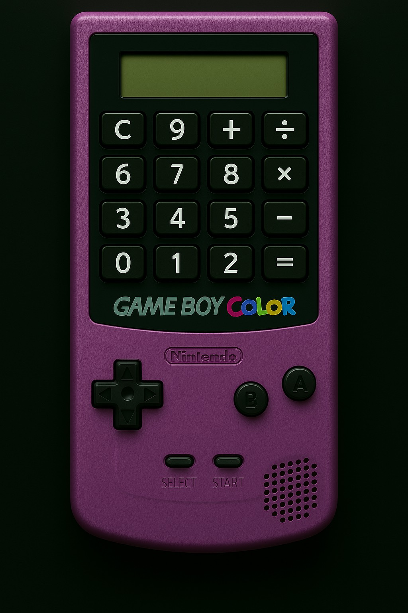

Game Boy Calculator

> A fully functional calculator that looks and feels like a Game Boy Color.

---

🕹 Features

- Built using **HTML, CSS, and JavaScript** — no libraries, no frameworks
- Buttons are **invisible overlays**, perfectly mapped to the Game Boy shell
- Output appears on the **green LCD** screen for a seamless retro vibe
- Mouse input only — no keyboard support yet
- `D-Pad`, `A`, and `B` buttons are decorative only (for now)

---

📷 Preview

---

🗂 Files

| File | Purpose |
|------|---------|
| `index.html` | Main UI with mapped button overlays |
| `style.css`  | Game Boy layout, responsive styles |
| `script.js`  | Calculator logic and display updates |
| `shell.png`  | Background Game Boy Color image |

---

✅ Future Enhancements

- Keyboard input support
- Functional D-Pad / A / B buttons
- Sound FX + screen transitions
- Full-screen toggle (real Game Boy illusion)

---

💡 How to Run

Just open `index.html` in your browser.  
No build tools, no bundlers — just plug and play.

---

License

MIT — use it, remix it, retro-style it.